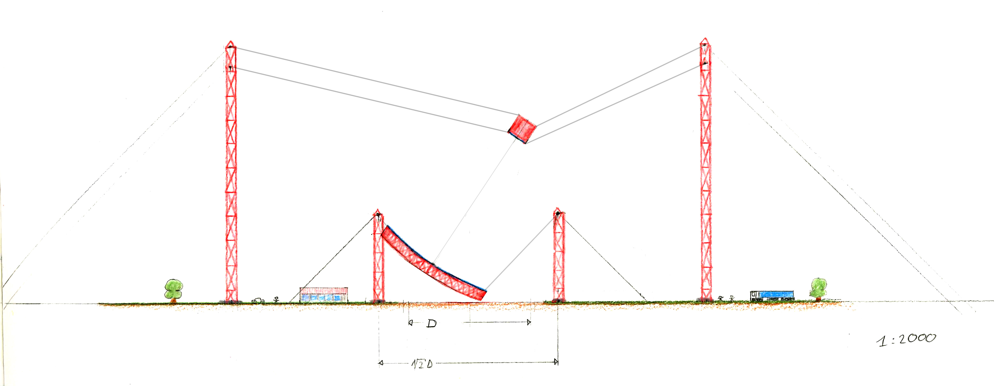
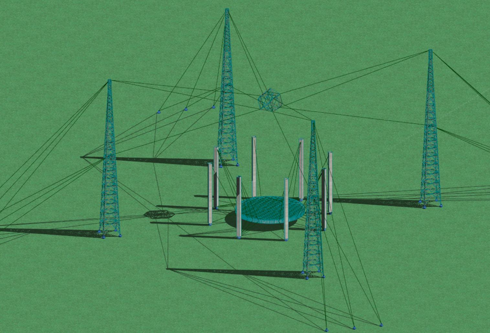

# Cable-Robo-Mount

A mount for the Cherenkov-plenoscope that can be build today.

### Working together
The [ETH Institute for Particle Physics](http://www.ipp.phys.ethz.ch/) explores together with the [ETH Department for Civil Engineering](https://www.baug.ethz.ch/en/) the possibilites to build nothing less but the most powerfull cosmic gamma-ray-timing-explorer ever planned.

From the first drafts

to the first concepts for an implementation...

### Simulating the mount
Finite element simulations from civil engineering are combined with [scinetific raytracing](https://github.com/cherenkov-plenoscope/merlict_development_kit) from particle physics. Together, the mechanical structure of the novel cable-robo-mount is investigated using its optical performance as a feedback. 
