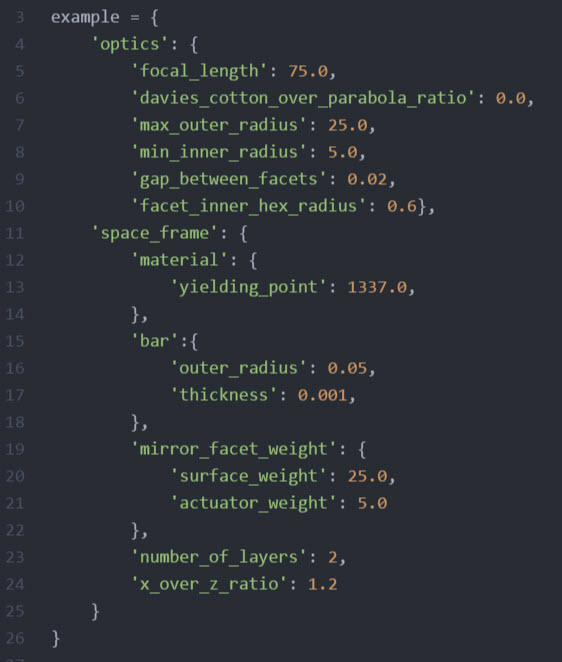

# A tiny tutorial on how to use the bridge interface with SAP2000
The procedure of running the necessary functions from the terminal in order to collect the deformed reflector (absolute coordinates) is shown.

### Requirements
- python 3.x and ipython

- SAP2000 v18.2 (probably works on other versions too, not tested though)

### First steps
- Install SAP2000 in a directory in your computer
- Clone robo_mount repository also in a directory in your computer
- Insert the necessary data in the two config files in:
  - ./robo_mount/reflector_study/config.py
  
  - ./robo_mount/reflector_study/config_loading.py
  
- Run the terminal and ipython

### In ipython
This is the most basic example, offered only as a reference.
~~~~
import reflector_study as rs
geometry = rs.Geometry(rs.config.example)
reflector = rs.factory.generate_reflector(geometry)
structural = rs.SAP2000_bridge.Structural(rs.SAP2000_bridge.config_loading.example)
~~~~
Up to now the geometry, reflector and structural parts are created.
~~~~
bridge = rs.SAP2000_bridge.Bridge(structural)
~~~~
SAP2000 initializes a new workspace, creates a new model with metric units, defines a steel material and a pipe cross section.
~~~~
bridge.nodes_definition(reflector)
bridge.frames_definition(reflector)
bridge.restraints_definition(reflector)
~~~~
The dish geometry is inserted.
~~~~
bridge.load_scenario_dead()
bridge.load_scenario_facet_weight(reflector)
bridge.run_analysis()
~~~~
Load scenarios are inserted and the analysis is run.
~~~~
reflector, reflector_deformed= bridge.get_deformed_reflector_for_all_nodes_for_selected_load_pattern(reflector, "dead_load")
~~~~
The final results are obtained.

*By using the function generate_reflector_roatated_position(reflector, rotation) in ./robo_mount/reflector_study/SAP2000_bridge/SAP2000_bridge_tools one can find the rotated reflector geometry. By simply replacing it with the original reflector, the final deformations for the rotated reflector can be obtained.*

---
**One can explore many more functions built in the Bridge class.**

---

**A very important pointer of SAP2000 OAPI is SapModel, which is hidden in the Bridge class (_SapModel). One can use it and explore many more built in functions.**
More details: [OAPI FAQ of Computer and Structures SAP2000](https://wiki.csiamerica.com/display/kb/OAPI+FAQ)
